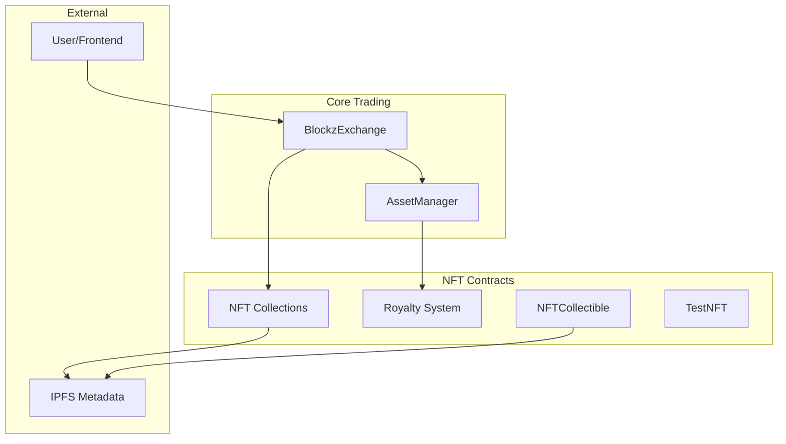

# Contract Overview

## 🏗️ Current System Architecture

The Blockz NFT marketplace consists of a minimal, efficient set of core contracts designed for secure and gas-optimized trading.

### System Diagram

## 📋 Contract Responsibilities

### BlockzExchange

**Role**: Core marketplace logic and order management

**Key Features**:

- EIP-712 signature-based orders
- Batch operations for gas efficiency
- Offer system with collection-wide and token-specific offers
- Signature validation with block range expiry
- Pause and access control mechanisms

**Interactions**:

- Calls `AssetManager` for payment processing
- Transfers NFTs via standard ERC-721 methods
- Validates signatures from trusted validator address

### AssetManager

**Role**: Financial coordination and payment distribution

**Key Features**:

- Bidding wallet system for users
- Automatic royalty distribution via EIP-2981
- Platform fee collection and management
- Whitelisted platform support
- Failed transfer recovery system

**Interactions**:

- Receives payment instructions from `BlockzExchange`
- Queries royalty information from NFT contracts
- Distributes payments to sellers, creators, and platform
- Manages user deposit/withdrawal functionality

### NFTCollectible

**Role**: Template for marketplace-optimized NFT collections

**Key Features**:

- Full ERC-721 + ERC-721Enumerable implementation
- Integrated EIP-2981 royalty support
- Flexible metadata management (IPFS/HTTP)
- Per-token and collection-wide royalty settings
- Gas-optimized for marketplace operations

**Usage**:

- Deployed by collection creators
- Integrated with marketplace for automatic royalty processing
- Supports complex royalty structures

### Royalty System

**Role**: Multi-recipient royalty management

**Key Features**:

- EIP-2981 standard compliance
- Support for multiple royalty recipients per token
- Collection-wide default settings with token-specific overrides
- Gas-optimized royalty calculations
- Backwards compatibility with simple royalty systems

### TestNFT

**Role**: Development and testing support

**Key Features**:

- Simplified ERC-721 implementation
- Public minting for easy testing
- Batch operations for test data generation
- Minimal overhead for development workflows

## 🔄 System Interactions

### NFT Listing Flow

1. **User** approves `BlockzExchange` for NFT transfer
2. **User** creates off-chain order signed with EIP-712
3. **Order data** stored in backend/indexer with signature
4. **Listing** becomes discoverable in marketplace UI

### Purchase Flow

1. **Buyer** calls `BlockzExchange.batchBuy()` with order data and signature
2. **BlockzExchange** validates signature and order expiry
3. **BlockzExchange** calls `AssetManager.payMPBatch()` with payment details
4. **AssetManager** queries NFT contract for royalty information
5. **AssetManager** distributes payment to seller, creator(s), and platform
6. **BlockzExchange** transfers NFT to buyer
7. **Events** emitted for indexer and UI updates

### Offer Acceptance Flow

1. **Buyer** creates off-chain offer with EIP-712 signature
2. **Seller** calls `BlockzExchange.acceptOfferBatch()` with offer and token signatures
3. **BlockzExchange** validates both signatures and token ownership
4. **Payment and transfer** flow identical to purchase flow

## 🔐 Security Architecture

### Access Control Layers

- **Contract Owner**: Emergency controls and configuration
- **Trusted Validator**: Signature validation for orders/offers
- **Whitelisted Platforms**: AssetManager integration access
- **Pause Mechanisms**: Emergency stops for all operations

### Signature Security

- **EIP-712 Standard**: Structured data signing with domain separation
- **Block Range Validation**: Time-limited signature validity
- **Nonce System**: Protection against replay attacks (via salts)
- **Trusted Validator**: Centralized signature validation for marketplace orders

### Financial Security

- **Reentrancy Guards**: Comprehensive protection on all value transfers
- **Failed Transfer Recovery**: Safe handling of payment failures
- **Separate Bidding Wallets**: User fund isolation
- **Royalty Validation**: Automatic creator compensation

## 📊 Gas Optimization Strategies

### Batch Operations

- Process up to 20 NFTs in single transaction
- Significant gas savings vs individual operations
- Optimized storage access patterns

### Storage Efficiency

- Packed structs for minimal storage slots
- Efficient mapping structures
- Event-based state synchronization

### Smart Execution

- Lazy loading of non-critical data
- Assembly optimizations in critical paths
- Minimal external calls

## 🔌 Integration Points

### Frontend Integration

- Web3 wallet connection via standard libraries
- Event listening for real-time updates
- Signature creation using EIP-712 libraries
- Batch operation support for improved UX

### Backend/Indexer Integration

- Event monitoring for database synchronization
- Signature validation and storage
- Order book management
- Analytics and reporting

### External Services

- IPFS for metadata storage
- Price oracles for multi-currency support (future)
- Analytics services for marketplace insights

## 🚀 Deployment Architecture

### Proxy Pattern

- **BlockzExchange**: Upgradeable via OpenZeppelin proxy
- **AssetManager**: Upgradeable via OpenZeppelin proxy
- **ProxyAdmin**: Manages upgrade authority

### Network Support

- **Primary**: Avalanche C-Chain
- **Testnet**: Fuji testnet
- **Development**: Local Anvil networks

### Configuration Management

- Environment-specific contract addresses
- Configurable platform fees and limits
- Flexible validator and admin key management

## 📈 Scalability Considerations

### Current Limitations

- 20 NFT limit per batch operation
- Single trusted validator for signatures
- Centralized signature validation

### Future Enhancements

- Multiple validator support
- Cross-chain bridge integration
- Layer 2 deployment options
- Gasless transaction support
